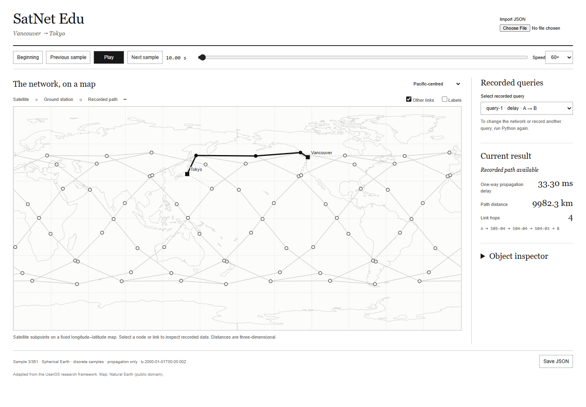

# SatNet Edu

**Build satellite networks. Explore how they work.**

SatNet Edu is a Python toolkit for exploring satellite networks through interactive
experiments. Create constellations, connect ground stations, compare routes and
watch your network evolve on a map. Share each experiment as a standalone HTML
file that anyone can open in a browser.



## Explore your network

- **Build with Python.** Define constellations, individual satellite orbits and ground stations with a simple API.
- **Compare routes.** Explore minimum-hop and minimum-propagation-delay paths, with distances and link details.
- **Study failures.** Schedule outages and inspect how connectivity changes and recovers.
- **Replay and inspect.** Play, pause and jump between recorded samples on a two-dimensional world map.
- **Share offline.** Export a self-contained HTML viewer or embed the JavaScript player in your own website.

Python runs the simulation and records its results. The player displays those
records, so your experiment remains available after Python is closed. No server,
online maps or Node.js installation is needed to view an exported HTML file.

## Get started

Use Python 3.11, then clone and install the project:

```bash
git clone https://github.com/de2008de/satnet-edu.git
cd satnet-edu
python -m pip install .
```

Create a network and export your first experiment:

```python
from satnet_edu import Network

net = Network("Vancouver to Tokyo")
net.add_constellation(
    planes=6, sats_per_plane=12, altitude_km=1000, inclination_deg=53,
)
net.add_ground_station("A", lat=49.28, lon=-123.12, label="Vancouver")
net.add_ground_station("B", lat=35.68, lon=139.69, label="Tokyo")

run = net.run(duration_s=1800, step_s=5, record_routes=[("A", "B")])
run.save("outputs/my-network.json")
run.export_html("outputs/my-network.html")
```

Open `outputs/my-network.html` in your browser to explore the result.
To try a ready-made example, run `python examples/first_network.py` and open
`outputs/experiment.html`.

## Try more experiments

| Example | Explore |
|---|---|
| [Compare routes](examples/compare_routes.py) | Minimum hops versus minimum one-way propagation delay |
| [Failure and recovery](examples/scheduled_failure.py) | Scheduled outages and changes in connectivity |
| [Custom orbits](examples/custom_constellation.py) | Individual satellites with your own orbital parameters |

Already have a recording? Open [the standalone player](web/demo/index.html) locally
and import your JSON file. To add playback to a website, see the
[embedding guide](docs/API.md#embedding) and [two-player example](web/demo/two-players.html).

## Documentation

[Python API](docs/API.md) · [Simulation model](docs/MODEL.md) · [Trace format](docs/TRACE_FORMAT.md)

## Research

*Commercial Dishes Can Be My Ladder: Sustainable and Collaborative Data Offloading
in LEO Satellite Networks*. IEEE INFOCOM 2025.
[Paper](https://doi.org/10.1109/INFOCOM55648.2025.11044527).
